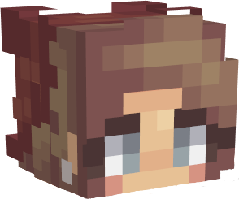
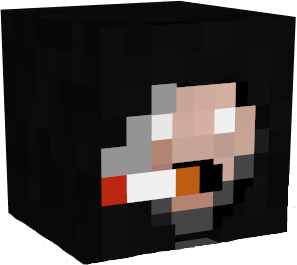
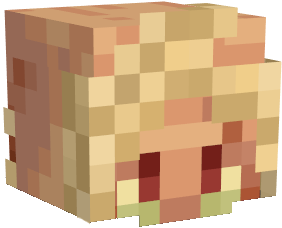

# MCTantrum

## Server IP: mct.tantrum.org

## QuickLinks

[Discord](https://discord.gg/GE8ngvwU6p)

[Website](https://mct.enjin.com/)

[DynMap](http://mct.tantrum.org:25501/)

[YouTube](https://www.youtube.com/channel/UCSufovTKvIoNjQHVOjXMt6g/featured)

## About

There are 2 owners,  ReasonFoundDecoy (Decoy) and  B\_White (B).

We are a 1.18.2 Slimefun server with many, many things to do! We created this server with Slimefun brains, but also kept in mind that some people don't care for it so we've implemented much more.

> The last server we played on was a P2W server. I spent $60 getting stuff for me, B, and our son. About a week later the owner stopped caring about the server and let it turn into a broken piece of shit and when he did come around he treated all the players like petty garbage and let us know he only kept the server up to make money. This is when the idea for MCTantrum first came about!
>
> \-ReasonFoundDecoy

We are **completely** against P2W. This is not who we are! We do have things for sale on our website, but they are strictly cosmetic and even that stuff is mostly obtainable in some way in-game.

Activity is also a priority. Server upkeep, implementing new ideas, listening to suggestions, and even playing some survival. The server is our biggest hobby, and we love doing it! Sometimes a short break is needed, but there is _**always**_ someone around to help.

 ABitOddish (Oddish) and  thepog1 (Sefiraat) are our moderators.

We handpicked our moderators because of their positive attitudes, knowledge of Minecraft and Slimefun, their happiness to help others, intelligence, chill demeanors, and ability to handle challenging situations, among many other reasons.

Please feel free to DM Decoy on discord if you have any questions, concerns, or comments.

(reason\_found\_decoy#1762)

| Noteworthy Aspects:               | Slimefun Addons:                |
| --------------------------------- | ------------------------------- |
| :dollar: Economy                  | :desktop: Networks              |
| :beers: Brewery                   | :magic\_wand: CrystamaeHistoria |
| :fireworks: AdvancedEnchantments  | :package: DankTech2             |
| :shopping\_cart: Dynamic Shop     | :pick: SlimeTinker              |
| :placard: Sign Shop               | :inbox\_tray: SimpleStorage     |
| :coin: Token Shop                 | :toolbox: SensibleToolbox       |
| :headstone: Keep Inventory        | :infinity: InfinityExpansion    |
| :crossed\_swords: Custom Spawners | :sparkler: LiteXpansion         |
| :trophy: Massive Rank Chain       | :zap: FluffyMachines            |
| :tent: Land Claims                | :rat: SlimeCustomizer           |
| :map: DynMap                      | :school\_satchel: DyedBackpacks |
| :briefcase: Jobs                  | :game\_die: LuckyBlocks         |
| :tickets: Auction House           | :cherries: ExoticGarden         |
| :hammer\_pick: McMMO              | :abacus: SFCalc                 |
| :dizzy\_face: HeadsDB             | :ice\_cube: SlimefunOreChunks   |
