# Custom Crafting

You can get a free Custom Recipe Book from the villager that lives inside the tree at spawn.

There are currently 9 categories in the Custom Recipe Book:

* Tantrum Armored Elytra
* Polished Gear
* Minecraft +
* Key Fragments
* Spawner Keys
* Tantrum Keys
* Summoning
* Shiny Wares
* Pokemon Recipes


Please note the Compass icon at the bottom of the page after you click on a category. This button is a filter and should be set to "Browse" to view **all** recipes in that category, or set to another filter type to view anything with that specific filter in that specific category.

If you click on a category and see nothing in it, make sure your filter is set to "Browse"!


## Tantrum Armored Elytra

This category only contains 1 item: Tantrum Wings.

Since Tantrum Wings are not available in the [Tantrum Crate](../economy/crates/tantrum-crate.md), you can craft them using a Tantrum Plate and an Elytra as a shapeless recipe in a crafting table.

### Recipes

#### Tantrum Wings

These wings can be upgraded to [Tier 2 - Polished](../tantrum-gear-progression/tier-2-polished/) if you truly do not alter them in any way.

## Polished Gear

This category contains all upgrade recipes for [Tier 1 - Tantrum](../tantrum-gear-progression/tier-1-tantrum/) to [Tier 2 - Polished](../tantrum-gear-progression/tier-2-polished/). All of these recipes are done in an anvil.


These recipes will only work if you have not altered your Tantrum gear in any way, shape, or form!! The NBT tags all have to be the original tags. Repairing items in an anvil will add an NBT tag, it is highly recommended to let mending do your...mending.


### Recipes

#### Polished Battleaxe

#### Polished Chestpiece

#### Polished Claymore

#### Polished Crown

#### Polished Earth-Grinder

#### Polished Hoe

#### Polished Javelin

#### Polished Longbow

#### Polished Platelegs

#### Polished Pole

#### Polished Spade

#### Polished Warboots

#### Polished Wings

## Minecraft +

The Minecraft + category contains 13 recipes we've made for regular vanilla Minecraft items.

### Recipes

#### Chainmail Boots

#### Chainmail Chestplate

#### Chainmail Helmet

#### Chainmail Leggings

#### Cobweb

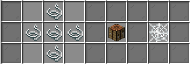

#### Diamond Horse Armor

#### Elytra

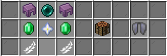

#### Golden Horse Armor

#### Heart of the Sea

#### Iron Horse Armor

#### Saddle

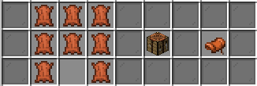

#### Totem of Undying

#### Trident

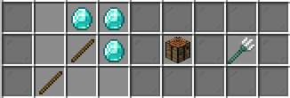

## Key Fragments


All Key Fragment recipes have a 2 hour cooldown, but the cooldown is **not shared**. For example, this means you could craft a Key Fragment using Ghast bits and then immediately craft another Key Fragment using Enderman bits, but you would not be able to craft a Key Fragment using Ghast bits again for 2 hours.


[Spawner Key Fragments](../economy/bits-heads-and-spawners.md#bits-for-crafting-purposes) are an ingredient to craft [Spawner Keys](../economy/bits-heads-and-spawners.md#heads-for-crafting-purposes).

As shown by each recipe, you can craft a Key Fragment by using stacks of any type of mob bits. These cannot be mix-and-matched! They must all be the same type of bit for each one.

### Recipes

## Spawner Keys

[Spawner Keys](../economy/bits-heads-and-spawners.md#heads-for-crafting-purposes) are crafted with any [Key Fragment](../economy/bits-heads-and-spawners.md#bits-for-crafting-purposes) (regardless of the type of bits you used to make it) and the type of mob heads respective to the spawner you intend to get.

For instance, you can make a Key Fragment using Enderman bits and use it in a Spawner Key recipe with Ghast heads and it will create a Ghast Spawner Key.


Spawner Keys are craftable at **any** time and have no cooldown to craft them, however the _**usage**_ of the key at the crates has a _**shared cooldown**_! If you use a key on a spawner crate, you will not be able to use any other Spawner Key on any other Spawner Crate for 8 hours. You can view your cooldown status on your quickboard.



Although these keys can be crafted at any rank, you will not be able to warp to Spawner\_Crates or use the key there until you reach Wither rank! You can also see if another player will craft it for you/open the crate for you.


### Recipes

## Tantrum Keys

When starting on your journey to obtain each piece of Tantrum gear, you'll find that you will have to open the [Tantrum Crate](../economy/crates/tantrum-crate.md) many times. You will most likely receive multiple items you already have. You could sell them or keep them, or you could create new [Tantrum Crates Keys](../tantrum-gear-progression/crate-key-and-upgrade-tokens.md#tantrum-crate-key) by combing any 2 pieces of the same type in a crafting table.

For example, 2 Tantrum Pants in a crafting table will make you a new Tantrum Crate Key.&#x20;

### Recipes

## Summoning

The Summoning category contains 3 recipes to craft Subpoenas for 3 different [Dragons](dragons/). These Subpoenas act like a catalyst to spawn its respective Dragon at the End.

* Subpoena: Margareet (Level 1)
* Subpoena: Meatloaf (Level 2)
* Subpoena: Potato (Level 3)

These Dragons are much harder to fight than the regular Ender Dragon and increase in difficulty with each level. They drop much more XP, and the amount of XP increases with each level.


All 3 of these recipes are craftable at any time, however they are gated behind different Prestige Ranks!


All Subpoenas are made in a smoker and take 12,000 ticks (10 minutes)

### Recipes

#### Subpoena: Margareet

#### Subpoena: Meatloaf

#### Subpoena: Potato

## Shiny Wares

Here you will find all recipes for [craftable resource pack](server-resource-pack/craftables.md) tools and weapons.

### Recipes

#### Emerald Tools/Weapons

#### Glowstone Tools/Weapons

#### Lapis Tools/Weapons

#### Obsidian Tools/Weapons

#### Quartz Tools/Weapons

#### Redstone Tools/Weapons

## Pokemon Recipes

This category contains all recipes that involve anything [Pokemon](server-resource-pack/pokemon.md) related, such as Pokeballs, eggs from breeding, and Unowns. We will be adding more recipes here as needed when new generations of Pokemon are released.

### Recipes

#### Apricorns

All apricorns can be cooked in a smoker. It takes 80 ticks (4 seconds) and gives .35 XP each.

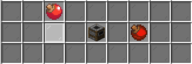

#### Pokeballs

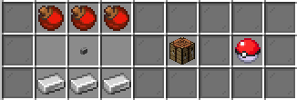

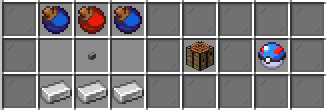

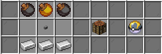

#### Eggs

Elekid

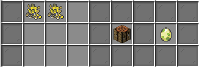

Togepi

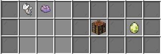

#### Porygon

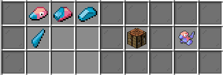

#### Unown Variations

Name a nametag with any letter of the alphabet (`B`, `C`, `D`), an exclamation point (`!`), or a question mark (`?`) in an anvil and combine it with Unown to create a new Unown form. Unown is found naturally as `A` form.

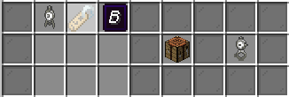

## Elite Crafting

You might come across situations where you'll need to use an Elite Crafting Table. These crafting tables are larger than 3x3 and are only found/used to do server specific things. For example, you will find 4x4 Elite Crafting Tables doing the puzzle type dungeons.


<mark style="color:red;">**MEGA WARNING:**</mark> <mark style="color:red;">Elite Crafting Tables are buggy and</mark> <mark style="color:red;"></mark><mark style="color:red;">**you should not shift-click**</mark> <mark style="color:red;"></mark><mark style="color:red;">items into them! Your items have a very high chance of disappearing</mark> <mark style="color:red;"></mark><mark style="color:red;">**forever**</mark> <mark style="color:red;"></mark><mark style="color:red;">if you shift-click to insert them!</mark>


