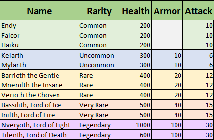

# Dragons

Our server features dragons with different rarities, names, stats, and loot tables. The vanilla dragon does not ever spawn. Spawning and killing any of these dragons will give you all the advancements you'd be able to get just like you would with the vanilla dragon.

Placing 4 End Crystals at the main End Island will spawn a random dragon. The spawning likelihood gets lower and loot gets better with increasing rarity.&#x20;

## Prestige Dragons

The summoning catalysts for Prestige Dragons are called [Subpoenas](../custom-crafting.md#summoning) and can be found in the Custom Recipe Book. Each one is gated by a different stage of Prestige. The Subpoena items are craftable at any time, but permissions to use them to summon dragons unlock gradually throughout the Prestige Ranks.

