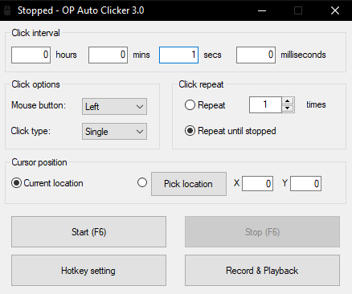

# Auto-Clickers and AFK

## Auto-Clickers

Basic and simple auto-clickers are not to be confused with aim-botting. _<mark style="color:red;">**Aim-bots are not allowed**</mark>_.

Auto-clickers can be used for many reasons. Some examples include having your sword hit mobs while you're afk, clicking Slimefun machines quickly, and throwing Pokeballs.&#x20;

Please keep in mind that if your clicker settings are too fast, you'll send too many packets and get kicked from the server. If this happens repeatedly we'll mention it to you about slowing down your clicker. If the problem persists, you may face a punishment for breaking [Rules](./) 5, 7, and 13.


Here is the link to the most widely used auto-clicker on our server:\
[https://sourceforge.net/projects/orphamielautoclicker/files/latest/download](https://sourceforge.net/projects/orphamielautoclicker/files/latest/download)

This link will automatically download the auto-clicker. It's very simple to use and requires virtually no setup.


## AFK

AFKing is absolutely allowed and there are no drawbacks to it at all. You won't get kicked after any amount of time, and AFK time counts towards playtime. Make the best of your away time while you rack up the playtime, money, heads, and other resources by AFK farming.


_If I say the word "time" one more...time...I'm gonna lose my shit_



The server restarts daily at 6:00am EST, so technically you'd be able to AFK farm for a max of 24hrs without having to log back in. _<mark style="color:red;">**Auto-relog is not allowed**</mark>_.


