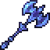
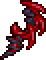
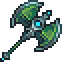
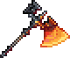
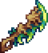
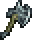

# Axes

####   Avalanche

####   Axe of Purity

####   Bloody Edge

####   Carnage

####   Caustic Edge

####   Fulguration Halberd

####   Galaxy Smasher

####   Grax

####  Inferna Cutter

####   Seeking Scorcher

####   Stellar Contempt

####   Terratomere

####   True Bloody Edge

####   True Caustic Edge

####   Waraxe
