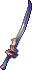

# Swords

Expand dropdowns to preview swords.

A - C

####   Absolute Zero

####   Abyss Blade

####   Aegis Blade

####   Aftershock

####   Anarchy Blade

####   Ancient Shiv

####   Animus

####   Aquatic Discharge

####   Aquatic Dissolution

####   Ark of the Ancients

####   Ark of the Cosmos

####   Ark of the Elements

####   Astral Blade

####   Astral Pike

####   Astral Scythe

####   Ataraxia

####   Baleful Harvester

####   Banshee Hook

####   Basher

####   Biome Blade

####   Blade of Enmity

####   Bladecrest Oathsword

####   Bloody Rupture

####   Bonebreaker

####   Brimlance

####   Brimlash Buster

####   Brimstone Sword

####   Briny Baron

####   Burnt Sienna

####   Catastrophe Claymore

####   Celestial Claymore

####   Comet Quasher

####   Corrupted Crusher Blade

####   Cosmic Shiv

####   Crimson Crusher Blade

####   Crystal Blade

D - L

####   Darklight Greatsword

####   Devastation

####   Devil's Devastation

####   Diseased Pike

####   Draconic Destruction

####   Dragon Rage

####   Earth

####   Earthen Pike

####   Elemental Excalibur

####   Elemental Lance

####   Entropic Claymore

####   Essence Flayer

####   Eutrophic Scimitar

####   Eutrophic Shank

####   Excelsus

####   Exo Gladius

####   Exoblade

####   Feralthorn Claymore

####   Flameburst Shortsword

####   Flarefrost Blade

####   Floodtide

####   Forbidden Oathblade

####   Forsaken Saber

####   Fractured Ark

####   Gael's Greatsword

####   Galactus Blade

####   Galileo Gladius

####   Gelitic Blade

####   Gilded Proboscis

####   Goldplume Spear

####   Grand Guardian

####   Greatsword of Blah

####   Greatsword of Judgement

####   Greentide

####   Hellfire Flamberge

####   Hellion Flower Spear

####   Hellkite

####   Holy Collider

####   Lion Heart

####   Lucrecia

M - W

####   Majestic Guard

####   Mariana

####   Mirror Blade

####   Mourningstar

####   Neptune's Bounty

####   Night's Stabber

####   Old Lord Oathsword

####   Omniblade

####   Phoenix Blade

####   Plague Keeper

####   Prismatic Breaker

####   Red Sun

####   Redtide Sword

####   Solstice Claymore

####   Soul Edge

####   Soul Harvester

####   Stellar Striker

####   Storm Ruler

####   Swordsplosion

####   Teardrop Cleaver

####   Temporal Floe Sword

####   Terra Edge

####   Terra Lance

####   Terra Shiv

####   Terror Blade

####   The Burning Sky

####   The Enforcer

####   The Last Mourning

####   The Mutilator

####   Trinity

####   True Excalibur Shortsword

####   True Forbidden Oathblade

####   True Night's Stabber

####   True Tyrant's Ultisword

####   Tyrant Yharim's Ultisword

####   Ultimus Cleaver

####   Vein Burster

####   Virulence

####   Warblade

####   Wind Blade

####   Wulfrum Blade

