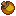
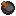
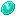
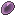
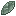
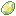
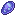
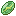
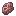

# PokeCache

The PokeCache is an hourly reward you can collect by doing <mark style="color:blue;">**/rewards**</mark>. This reward does stack, meaning if you are AFK for 6 hours, you will come back and be able to claim 6x PokeCache. You must be online for the timer to count.

### Contents

| Item                                                                                     | Drop Chance |
| ---------------------------------------------------------------------------------------- | ----------- |
| 16x .png>) Pokeball                            | 25%         |
| 16x .png>) Greatball                          | 22%         |
| 16x .png>) Ultraball                          | 19%         |
| 1x  Masterball                               | 0.1%        |
| 32x  Cooked Red Apricorn              | 25%         |
| 32x  Cooked Blue Apricorn            | 25%         |
| 32x  Cooked Yellow Apricorn        | 25%         |
| 32x  Cooked Black Apricorn          | 25%         |
| 1x  Dawn Stone                                | 10%         |
| 1x  Dusk Stone                                | 10%         |
| 1x  Ice Stone                                  | 10%         |
| 1x  Leaf Stone                                | 10%         |
| 1x  Moon Stone | 10%         |
| 1x  Shiny Stone                              | 10%         |
| 1x  Water Stone                              | 10%         |
| 1x  Thunder Stone                          | 10%         |
| 1x  Sun Stone                                  | 10%         |
| 1x  Meteorite                                 | 8%          |
| 1x  Lustrous Orb                          | 0.1%        |
| 1x  Adamant Orb                            | 0.1%        |
| 1x  Griseous Orb                          | 0.1%        |
| 1x  Azure Flute                            | 0.1%        |
| 1x  ₽1,000      | 25%         |
| 4x  ₽1,000      | 22%         |
| 8x  ₽1,000      | 19%         |
| 1x  Incense Burner                      | 15%         |
| 1x  Full Incense                            | 13%         |
| 1x  Luck Incense                            | 13%         |
| 1x  Pure Incense                            | 13%         |
| 1x  Odd Incense                              | 13%         |
| 1x  Wave Incense                            | 13%         |
