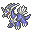
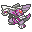

# Quests

## Egg Hatching Quests

Breeding Pokemon and right clicking the egg will start a hatching quest. The warning to only have ONE egg in your inventory at a time applies at the end of your quest. When the correct amount of steps are reached, the quest will remove a pokemon egg from your inventory.


&#x20;<mark style="color:red;">If you have more than one egg in your inventory when the end of the quest triggers, it will randomly choose any egg you have and this means it could choose the wrong one!</mark> You may have multiple hatching quests going at once, but be use extra caution when any of your quests are nearing the end, and carefully place eggs you don't intend to get removed in a chest or other inventory for temporary storage until your intended quests removes the correct egg from your inventory.


### Azurill

### Chingling

### Elekid

### Happiny

### Illumise

### Mantyke

### Mime Jr.

### Munchlax

### Togepi

## Legendary Quests

There are currently 4 Legendary Pokemon that can only be obtained via quest: Dialga, Palkia, Giratina, and Arceus. In order to obtain these Pokemon, first you must win one of the orbs from the [PokeCache](https://app.gitbook.com/s/ds7aHdIFHflqDb6wMwxU/\~/changes/Yu6gjmQSJISRVKY2bt2N/general/server-resource-pack/pokemon/pokecache). PokeCache is the only way to get these orbs, and they have a very low drop rate, for obvious reasons.

Once you get an orb, right click with it to start your quest. You can do /quests started to track it. The quests require you to have the orb in your inventory, and to find the Timespace Altar. Once you've reached the Timespace Altar and have the orb in your inventory, your quest will automatically complete, the orb will be removed, and you will be given the corresponding Legendary Pokemon.


Public warps are not to be set at the Timespace Altar. You man set a personal home there if you wish and you are allowed to talk about the location of the structure, but you are not allowed to teleport others there or set public warps.


###  Dialga

Required Item:  Adamant Orb

###  Palkia

Required Item:  Lustrous Orb

###  Giratina

Required Item:  Griseous Orb

###  Arceus

Required Item:  Azure Flute

