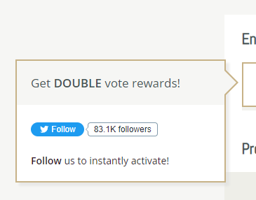

# Voting

There are 20 vote sites that you can vote on, each one gives you 1 [Vote Crate](../economy/crates/vote-crate/). Why so many? Simple! Each vote benefits you and also benefits the server! You get free stuff, the server gets more visibility.

Sometimes a vote site may be experiencing issues. This is something only the website developer can fix and/or control.

You can vote while not being logged in to the game and you'll still receive your Vote Crates when you do arrive, as long as you already have an empty inventory slot for them to go to.

There are 4 different ways you can vote.

* Vote via website: [https://mct.enjin.com/voting](https://mct.enjin.com/voting)
* Run <mark style="color:blue;">**/votelist**</mark> or <mark style="color:blue;">**/vote**</mark> in game to see all the sites
* Find all the vote links in discord channel #server-voting
* Find all links down below!

## Vote Sites

The following is a list of all vote sites we use and how long before you can vote again for each one.

| Website/Link                                                                             | Time Gate               | Alts/family member can vote same day? |
| ---------------------------------------------------------------------------------------- | ----------------------- | ------------------------------------- |
| [PlanetMinecraft.com](https://www.planetminecraft.com/server/mctantrum/vote/)            | 24 hours                | no                                    |
| [Minestatus.net](https://minestatus.net/server/vote/mct.tantrum.org)                     | 24 hours                | yes                                   |
| [Minebrowse.com](https://minebrowse.com/server/2481)                                     | 24 hours                | yes                                   |
| [MinecraftList.org](https://minecraftlist.org/vote/24598)                                | 24 hours                | yes                                   |
| [serverlist.games](https://serverlist.games/vote/5099)                                   | 20 hours                | no                                    |
| [MinecraftServers.org](https://minecraftservers.org/vote/608489)                         | 12 hours                | no                                    |
| [Minecraft-Server-List.com](https://minecraft-server-list.com/server/474392/vote/)       | 12 hours                | yes                                   |
| [topg.org](https://topg.org/minecraft-servers/server-625558)                             | 12 hours                | yes                                   |
| [MCServertime.com](https://mcservertime.com/server-mctantrum.590/vote)                   | 12 hours                | yes                                   |
| [ServerPact.com](https://www.serverpact.com/vote-46405)                                  | 12 hours                | yes                                   |
| [BestServers.com](https://bestservers.com/server/1222/vote)                              | 12 hours                | yes                                   |
| [List-Minecraft-Server.com](https://list-minecraft-server.com/server-mctantrum.757/vote) | 6 hours                 | no                                    |
| [Minecraft-MP.com](https://minecraft-mp.com/server/281008/vote/)                         | 12am EST                | yes                                   |
| [Minecraft-Tracker.com](https://minecraft-tracker.com/server/6691/vote/)                 | 12am EST                | yes                                   |
| [topminecraftservers.org](https://topminecraftservers.org/server/25402)                  | 12am EST                | no                                    |
| [Minelist.net](https://minelist.net/vote/3762)                                           | 12am CT                 | yes                                   |
| [Minecraft-Server.net](https://minecraft-server.net/vote/B\_White/)                      | 12am UTC                | yes                                   |
| [mclike.com](https://mclike.com/vote-191037)                                             | 3am GMT                 | no                                    |
| [MC-Servers.com](https://mc-servers.com/mcvote/4884/)                                    | Once per day/unspecific | yes                                   |
| [MineServers.com](https://mineservers.com/server/dr86PAcQ/vote)                          | Once per day/unspecific | yes                                   |


The image below shows something that is displayed on **MineServers.com**. It is not true! They have no control over what rewards servers give out to voters.


## Vote Party

Vote parties need 600 votes to activate. This may seem like a lot, but with 20 vote sites, it usually doesn't take too long. You only need to have a minimum of 15 votes to be included in the party when it hits. If you are not logged in at the time, you will receive your rewards next time you join. Offline voting does count towards vote party. Rewards are as follows:

* <mark style="color:green;">**+ 6,000**</mark> Claim Blocks
* <mark style="color:green;">**+ 2,000**</mark> Tokens
* <mark style="color:green;">**+ $500,000**</mark>
* <mark style="color:green;">**+ 30,971**</mark> XP Points (roughly levels 0-100)

When the voteparty hits, anyone who has met the criteria will have a broadcast with their name saying you've reached maximum R.G.P. What's R.G.P.? It stands for Raw Gamer Potential - it's basically nothing, just a term that you might see from time to time.
