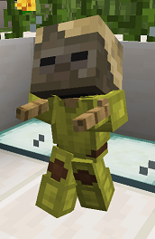

# Husk

## Requirements

85 hours playtime

* Be on the server for 85 hours

This can include AFK time.

2,600 McMMO power level

* Reach a power level of 2,600

McMMO XP can also be found in Vote Crates!

<mark style="color:purple;">Quest:</mark> Gimme Your Money

* Type: <mark style="color:blue;">**/cheque 62500**</mark>
* Have: Cheque for <mark style="color:green;">**$62,500.00**</mark>

Hold a piece of paper in hand while running the command.

The cheque for this quest is automatically removed after you make it.

<mark style="color:purple;">Quest:</mark> Husk Homicide

* Kill: 225 Husks

Track your quest progress by typing <mark style="color:blue;">**/quests started**</mark>.

## Rewards

<mark style="color:green;"><strong>+ 1</strong></mark> <mark style="color:blue;"><strong>/sethome</strong></mark>

* Receive 1 more slot for a home point

You now have a total of 5 <mark style="color:blue;">**/sethome**</mark> locations.

<mark style="color:green;">+ 50</mark> XP levels

* Receive 50 levels worth of XP

<mark style="color:blue;">/checkexp</mark> perms

* Permissions to use <mark style="color:blue;">**/checkexp**</mark> command

See detailed information about your XP, including how many more XP points you need until you get to the next level.

