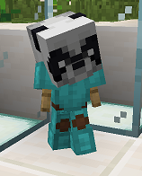

# Panda

## Requirements

45 hours playtime

* Be on the server for 45 hours

This can include AFK time.

250 McMMO power level

* Reach a power level of 250

McMMO XP can also be found in Vote Crates!

<mark style="color:purple;">Quest:</mark> Gimme Your Money

* Type: <mark style="color:blue;">**/cheque 2500**</mark>
* Have: Cheque for <mark style="color:green;">**$2,500.00**</mark>

Hold a piece of paper in hand while running the command.

The cheque for this quest is automatically removed after you make it.

## Rewards

<mark style="color:green;">+ 30</mark> XP levels

* Receive 30 levels worth of XP

<mark style="color:green;">+ 1</mark> DankPack (Tier 5) (Slimefun)

* Receive a Tier 5 DankPack

A 5th Tier DankPack is a portable storage container that can hold 5 different items, each item maximum storage being 8,192.

It will automatically vacuum you_r_ specified items and store them.

_DankPacks do not vacuum anything at all if your inventory is completely full! **You must have at least one empty inventory slot open for this item to work properly**._

Toggle compass in <mark style="color:blue;">/options</mark>

* New option available in <mark style="color:blue;">**/options**</mark>: Toggle Compass

Compass will appear at the top of your screen.

Access to weekly rewards

* Weekly rewards now available in <mark style="color:blue;">**/rewards**</mark>

Weekly rewards include:

* <mark style="color:green;">**+ 7,000**</mark> Claim Blocks
* <mark style="color:green;">**+ $100,000**</mark>
* <mark style="color:green;">**+ 150**</mark> XP levels
* <mark style="color:green;">**+ 750**</mark> Tokens

