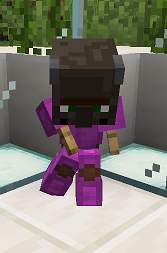

# Ravager

## Requirements

105 hours playtime

* Be on the server for 105 hours

This can include AFK time.

<mark style="color:purple;">Quest:</mark> Gimme Your Money

* Type: <mark style="color:blue;">**/cheque 250000**</mark>
* Have: Cheque for <mark style="color:green;">**$250,000.00**</mark>

Hold a piece of paper in hand while running the command.

The cheque for this quest is automatically removed after you make it.

<mark style="color:purple;">Quest:</mark> Villager Vanquisher

* Kill: 125 Villagers

Track your quest progress by typing <mark style="color:blue;">**/quests started**</mark>.

## Rewards

<mark style="color:green;">+ 50</mark> XP levels

* Receive 50 levels worth of XP

<mark style="color:blue;">/ride</mark> perms

* Permissions to use <mark style="color:blue;">**/ride**</mark> command

Ride on the shoulders of other players by looking at them and running the command!

