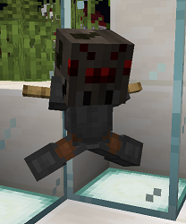

# Spider

## Requirements

65 hours playtime

* Be on the server for 65 hours

This can include AFK time.

1,250 McMMO power level

* Reach a power level of 1,250

McMMO XP can also be found in Vote Crates!

<mark style="color:purple;">Quest:</mark> Gimme Your Money

* Type: <mark style="color:blue;">**/cheque 12500**</mark>
* Have: Cheque for <mark style="color:green;">**$12,500.00**</mark>

Hold a piece of paper in hand while running the command.

The cheque for this quest is automatically removed after you make it.

<mark style="color:purple;">Quest:</mark> Spider Slayer

* Kill: 200 Spiders

Track your quest progress by typing <mark style="color:blue;">**/quests started**</mark>.

## Rewards

<mark style="color:green;">+ 40</mark> XP levels

* Receive 40 levels worth of XP

<mark style="color:blue;">/sc</mark> perms

* Permissions to use <mark style="color:blue;">**/sc**</mark> command

If you want to copy a sign, look at it and type **/sc**. Then go to another sign and punch it to paste.

Shift to edit signs toggle in <mark style="color:blue;">/options</mark>

* New option available in <mark style="color:blue;">**/options**</mark>: Sign Shift Edit

Shift-click a sign to edit it.

