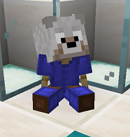

# Wolf

## Requirements

55 hours playtime

* Be on the server for 55 hours

This can include AFK time.

500 McMMO power level

* Reach a power level of 500

McMMO XP can also be found in Vote Crates!

<mark style="color:purple;">Quest:</mark> Gimme Your Money

* Type: <mark style="color:blue;">**/cheque 5000**</mark>
* Have: Cheque for <mark style="color:green;">**$5,000.00**</mark>

Hold a piece of paper in hand while running the command.

The cheque for this quest is automatically removed after you make it.

## Rewards

<mark style="color:green;">+ 1</mark> <mark style="color:blue;">/sethome</mark>

* Receive 1 more slot for a home point

You now have a total of 4 <mark style="color:blue;">**/sethome**</mark> locations.

<mark style="color:green;">+ 35</mark> XP levels

* Receive 35 levels worth of XP

<mark style="color:blue;">/chat</mark> perms

* Permissions to use <mark style="color:blue;">**/chat**</mark> command and all its variations

<mark style="color:blue;">**/chat create \<roomname>**</mark> - Create a chat room

<mark style="color:blue;">**/chat invite \<player>**</mark> - Invite someone to a chat room

<mark style="color:blue;">**/chat join \<roomname>**</mark> - Join a chat room

<mark style="color:blue;">**/chat kick \<player>**</mark> - Kick someone from a chat room

<mark style="color:blue;">**/chat leave \<roomname>**</mark> - Leave a chatroom

<mark style="color:blue;">**/chat list**</mark> - Lists all people in your current chat room

