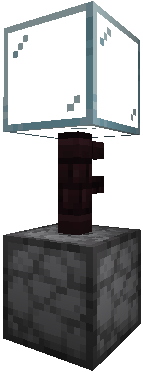

# Basic Machines

###  Output Chest

**XP Cost:** 20 Levels

**Research Group:** (none)

**Description:** A basic machine will try to put items in this chest if it's placed adjacent to the dispenser.

###  Enhanced Crafting Table

**XP Cost:** (none)

**Research Group:** (none)

**Description:** A multiblock structure. Many Slimefun items need to be crafted in this special crafting table. Place items in the dispenser and right-click the crafting table to activate.

###  Grind Stone

**XP Cost:** 4 Levels

**Research Group:** (none)

**Description:** A multiblock structure. Grinds items down into other items. Place items in the dispenser and right-click the fence the activate.

###  Armor Forge

**XP Cost:** 2 Levels

**Research Group:** (none)

**Description:** A multiblock structure. Gives you the ability to create powerful armor. Place items in the dispenser and right-click the anvil to activate.

###  Ore Crusher

**XP Cost:** 6 Levels

**Research Group:** Ore Doubling

**Description:** A multiblock structure. Crushes ores to their respective dusts and doubles them, i.e. 1 ore = 2 dusts. Place items in the dispenser and right-click the nether brick fence to activate.

###  Compressor

**XP Cost:** 9 Levels

**Research Group:** Carbon Creation

**Description:** A multiblock structure. Compresses items. Place items in the dispenser and right-click the nether brick fence to activate.

.png>)

### \_JE1.png) Makeshift Smeltery

**XP Cost:** 6 Levels

**Research Group:** (none)

**Description:** A multiblock structure. Improvised version of the Smeltery that only allows you to smelt dusts into ingots.

###  Smeltery

**XP Cost:** 10 Levels

**Research Group:** (none)

**Description:** A multiblock structure. A high-temperature furnace that allows you to smelt dusts into ingots and create alloys. Place items in the dispenser and right-click the nether brick fence to activate.

.png>)

###  Automatic Ignition Chamber

**XP Cost:** 12 Levels

**Research Group:** (none)

**Description:** Automatically relights the fire under the Smeltery. Place the Automatic Ignition Chamber adjacent to the Smeltery's dispenser and fill with Flint and Steels. You must manually light the first once first for this to work properly.

###  Pressure Chamber

**XP Cost:** 14 Levels

**Research Group:** (none)

**Description:** A multiblock structure. Compresses items even further. Place items in the dispenser and right-click the cauldron to activate.

###  Magic Workbench

**XP Cost:** 12 Levels

**Research Group:** (none)

**Description:** A multiblock structure. Infuses items with magical energy. Place items in the dispenser and right-click the crafting table to activate.

###  Ore Washer

**XP Cost:** 5 Levels

**Research Group:** (none)

**Description:** A multiblock structure. Filters Sifted Ore to get dusts and stone chunks. Place Sifted Ore in the dispenser and right-click the fence to activate. To optimize getting exactly what you need from Sifted Ore, we have the Legacy setting turned on which allows for you to place the dusts you wish to receive in the dispenser slots and you can use the machine without it stopping due to it being filled up.

###  Table Saw

**XP Cost:** 4 Levels

**Research Group:** (none)

**Description:** A multiblock structure. Allows you to get 8 planks from 1 log. Right click saw with logs to activate.

###  Composter

**XP Cost:** 3 Levels

**Research Group:** (none)

**Description:** Converts various materials into dirt over time.

###  Automated Panning Machine

**XP Cost:** 17 Levels

**Research Group:** (none)

**Description:** A multiblock structure. This one machine does the job both the Gold Pan and Nether Gold Pan.

###  Industrial Miner

**XP Cost:** 28 Levels

**Research Group:** (none)

**Description:** A multiblock structure that is intended to be built many times. This machine will mine ores in a 7x7x7 area underneath it. Place coal (or similar) in its chest for fuel. Right-click the blast furnace to activate.&#x20;

###  Advanced Industrial Miner

**XP Cost:** 36 Levels

**Research Group:** (none)

**Description:** A multiblock structure. This machine will mine ores in an 11x11x11 area underneath it. Place a bucket of fuel or lava in its chest for fuel. Right-click the blast furnace to activate.

###  Crucible

**XP Cost:** 13 Levels

**Research Group:** (none)

**Description:** Used to smelt items into liquids.

### .png>) Juicer

**XP Cost:** 29 Levels

**Research Group:** (none)

**Description:** A multiblock structure. Allows you to create delicious juice. Juice can be put in your Cooler. Place ingredients in the dispenser and right-click the nether brick fence to activate.

###  Enhanced Furnace - I

**XP Cost:** 7 Levels

**Research Group:** Enhanced Furnace

**Description:**&#x20;

* Processing Speed: 1x
* Fuel Efficiency: 1x
* Luck Multiplier: 1x

###  Enhanced Furnace - II

**XP Cost:** 7 Levels

**Research Group:** Enhanced Furnace

**Description:**

* Processing Speed: 2x
* Fuel Efficiency: 1x
* Luck Multiplier: 1x

###  Enhanced Furnace - III

**XP Cost:** 18 Levels

**Research Group:** Better Furnaces

**Description:**

* Processing Speed: 2x
* Fuel Efficiency: 2x
* Luck Multiplier: 1x

###  Enhanced Furnace - IV

**XP Cost:** 18 Levels

**Research Group:** Better Furnaces

**Description:**

* Processing Speed: 3x
* Fuel Efficiency: 2x
* Luck Multiplier: 1x

###  Enhanced Furance - V

**XP Cost:** 18 Levels

**Research Group:** Better Furnaces

**Description:**

* Processing Speed: 3x
* Fuel Efficiency: 2x
* Luck Multiplier: 2x

###  Enhanced Furnace - VI

**XP Cost:** 18 Levels

**Research Group:** Better Furnaces

**Description:**

* Processing Speed: 3x
* Fuel Efficiency: 3x
* Luck Multiplier: 2x

###  Enhanced Furnace - VII

**XP Cost:** 18 Levels

**Research Group:** Better Furnaces

**Description:**

* Processing Speed: 4x
* Fuel Efficiency: 3x
* Luck Multiplier: 2x

###  Enhanced Furnace - VIII

**XP Cost:** 29 Levels

**Research Group:** High Tier Furnace

**Description:**

* Processing Speed: 4x
* Fuel Efficiency: 4x
* Luck Multiplier: 2x

###  Enhanced Furnace - IX

**XP Cost:** 29 Levels

**Research Group:** High Tier Furnace

**Description:**

* Processing Speed: 5x
* Fuel Efficiency: 4x
* Luck Multiplier: 2x

###  Enhanced Furnace - X

**XP Cost:** 29 Levels

**Research Group:** High Tier Furnace

**Description:**

* Processing Speed: 5x
* Fuel Efficiency: 5x
* Luck Multiplier: 2x

###  Enhanced Furnace - XI

**XP Cost:** 29 Levels

**Research Group:** High Tier Furnace

**Description:**

* Processing Speed: 5x
* Fuel Efficiency: 5x
* Luck Multiplier: 3x

###  Reinforced Furnace

**XP Cost:** 32 Levels

**Research Group:** (none)

**Description:**

* Processing Speed: 10x
* Fuel Efficiency: 10x
* Luck Multiplier: 3x

### Cabonado Edged Furnace

**XP Cost:** 35 Levels

**Research Group:** (none)

**Description:**

* Processing Speed: 20x
* Fuel Efficiency: 10x
* Luck Multiplier: 3x

###  Block Placer

**XP Cost:** 17 Levels

**Research Group:** (none)

**Description:** All blocks put in this dispenser will automatically get placed when supplied with a redstone signal.
