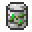

# Miscellaneous Items

###  Sifted Ore

XP Cost: 5 Levels

Research Group: Ore Washer

###  Wheat Flour

XP Cost: 5 Levels

Research Group: Slimefun Cuisine

###  Steel Plate

XP Cost: 14 Levels

Research Group: (none)

###  Chain

XP Cost: 15 Levels

Research Group: Grappling Hook

###  Hook

XP Cost: 15 Levels

Research Group: Grappling Hook

###  Stone Chunk

XP Cost: 5 Levels

Research Group: Ore Washer

###  Salt

XP Cost: 5 Levels

Research Group: Slimefun Cuisine

###  Heavy Cream

XP Cost: 5 Levels

Research Group: Slimefun Cuisine

###  Cheese

XP Cost: 5 Levels

Research Group: Slimefun Cuisine

###  Butter

XP Cost: 5 Levels

Research Group: Slimefun Cuisine

###  Crushed Ore

XP Cost: 25 Levels

Research Group: Ore Purification

###  Pulverized Ore

XP Cost: 25 Levels

Research Group: Ore Purification

###  Pure Ore Cluster

XP Cost: 25 Levels

Research Group: Ore Purification

###  Tiny Pile of Uranium

XP Cost: 30 Levels

Research Group: Radioactive

###  Small Chunk of Uranium

XP Cost: 30 Levels

Research Group: Radioactive

###  Cloth

XP Cost: 2 Levels

Research Group: First Aid

###  Tin Can

XP Cost: 2 Levels

Research Group: First Aid

###  Gold Block (24-Carat)

XP Cost: 19 Levels

Research Group: (none)

###  Reinforced Plate

XP Cost: 15 Levels

Research Group: Withstanding Explosions

###  Duct Tape

XP Cost: 14 Levels

Research Group: (none)

###  Organic Food (Wheat)

XP Cost: 25 Levels

Research Group: Organic Food

###  Organic Food (Carrot)

XP Cost: 25 Levels

Research Group: Organic Food

###  Organic Food (Potato)

XP Cost: 25 Levels

Research Group: Organic Food

###  Organic Food (Wheat Seeds)

XP Cost: 25 Levels

Research Group: Organic Food

###  Organic Food (Beetroot)

XP Cost: 25 Levels

Research Group: Organic Food

###  Organic Food (Melon Slice)

XP Cost: 25 Levels

Research Group: Organic Food

###  Organic Food (Apple)

XP Cost: 25 Levels

Research Group: Organic Food

###  Organic Food (Sweet Berries)

XP Cost: 25 Levels

Research Group: Organic Food

###  Organic Food (Dried Kelp)

XP Cost: 25 Levels

Research Group: Organic Food

###  Organic Food (Cocoa Beans)

XP Cost: 25 Levels

Research Group: Organic Food

###  Organic Food (Seagrass)

XP Cost: 25 Levels

Research Group: Organic Food

###  Organic Fertilizer (Wheat)

XP Cost: 36 Levels

Research Group: Organic Fertilizer

###  Organic Fertilizer (Carrot)

XP Cost: 36 Levels

Research Group: Organic Fertilizer

###  Organic Fertilizer (Potato)

XP Cost: 36 Levels

Research Group: Organic Fertilizer

###  Organic Fertilizer (Wheat Seeds)

XP Cost: 36 Levels

Research Group: Organic Fertilizer

###  Organic Fertilizer (Beetroot)

XP Cost: 36 Levels

Research Group: Organic Fertilizer

###  Organic Fertilizer (Melon Slice)

XP Cost: 36 Levels

Research Group: Organic Fertilizer

###  Organic Fertilizer (Apple)

XP Cost: 36 Levels

Research Group: Organic Fertilizer

###  Organic Fertilizer (Sweet Berries)

XP Cost: 36 Levels

Research Group: Organic Fertilizer

###  Organic Fertilizer (Dried Kelp)

XP Cost: 36 Levels

Research Group: Organic Fertilizer

###  Organic Fertilizer (Cocoa Beans)

XP Cost: 36 Levels

Research Group: Organic Fertilizer

###  Organic Fertilizer (Seagrass)

XP Cost: 36 Levels

Research Group: Organic Fertilizer
