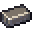

# Alloy Ingots

###  Reinforced Alloy Ingot

**XP Cost:** 22 Levels

**Research Group:** Reinforced Alloy



* Smeltery
* Electric Smeltery
* Advanced Smeltery (Infinity Expansion)
*







###  Hardened Metal

**XP Cost:** 22 Levels

**Research Group:** Reinforced Alloy







**Enhanced Crafting Table:**

* Climbing Pick



###  Damascus Steel Ingot

**XP Cost:** 17 Levels

**Research Group:** (none)











###  Steel Ingot

**XP Cost:** 11 Levels

**Research Group:** (none)







**Enhanced Crafting Table:**

* Climbing Pick



###  Ferrosilicon

**XP Cost:** 12 Levels

**Research Group:** Silicon Valley







**Enhanced Crafting Table:**

* Smelter's Pickaxe

**Magic Workbench:**

* Explosive Pickaxe
* Explosive Shovel
* Pickaxe of the Seeker



###  Bronze Ingot

**XP Cost:** 8 Levels

**Research Group:** (none)











###  Duralumin Ingot

**XP Cost:** 12 Levels

**Research Group:** Advanced Alloys











###  Billon Ingot

**XP Cost:** 12 Levels

**Research Group:** Advanced Alloys











###  Brass Ingot

**XP Cost:** 12 Levels

**Research Group:** Advanced Alloys











###  Aluminum Brass Ingot

**XP Cost:** 12 Levels

**Research Group:** Advanced Alloys











###  Aluminum Bronze Ingot

**XP Cost:** 12 Levels

**Research Group:** Advanced Alloys











###  Corinthian Bronze Ingot

**XP Cost:** 12 Levels

**Research Group:** Advanced Alloys











###  Solder Ingot

**XP Cost:** 12 Levels

**Research Group:** Advanced Alloys











###  Nickel Ingot

**XP Cost:** 10 Levels

**Research Group:** Even More Ores







**Enhanced Crafting Table:**

* Cobalt Pickaxe



###  Cobalt Ingot

**XP Cost:** 10 Levels

**Research Group:** Even More Ores







**Enhanced Crafting Table:**

* Cobalt Pickaxe



###  Gilded Iron

**XP Cost:** 11 Levels

**Research Group:** (none)







**Magic Workbench:**

* Lumber Axe
* Pickaxe of Vein Mining



###  Redstone Alloy Ingot

**XP Cost:** 16 Levels

**Research Group:** (none)










