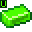
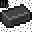

# Irradiated Materials

###  Uranium

###  Boosted Uranium

### .png>) Nether Ice

### .png>) Enriched Nether Ice

###  Blistering Ingot (33%)

###  Blistering Ingot (66%)

###  Blistering Ingot

###  Neptunium

###  Plutonium
