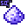

# Valuables and Misc

###  Synthetic Sapphire

**XP Cost:** 16 Levels

**Research Group:** (none)











###  Synthetic Diamond

**XP Cost:** 10 Levels

**Research Group:** Synthetic Diamonds







**Magic Workbench:**

* Lumber Axe
* Explosive Pickaxe
* Explosive Shovel
* Pickaxe of the Seeker
* Pickaxe of Vein Mining



###  Synthetic Emerald

**XP Cost:** 17 Levels

**Research Group:** (none)







**Magic Workbench:**

* Lumber Axe



###  Raw Carbonado

**XP Cost:** 26 Levels

**Research Group:** Carbonado











###  Carbonado

**XP Cost:** 26 Levels

**Research Group:** Carbonado











###  Carbon

**XP Cost:** 9 Levels

**Research Group:** Carbon Creation











###  Compressed Carbon

**XP Cost:** 10 Levels

**Research Group:** Synthetic Diamonds











###  Carbon Chunk

**XP Cost:** 10 Levels

**Research Group:** Synthetic Diamonds











###  Sulfate

**XP Cost:** 12 Levels

**Research Group:** Important Power-Related Items











###  Silicon

**XP Cost:** 12 Levels

**Research Group:** Silicon Valley











###  Magnesium Salt

**XP Cost:** 20 Levels

**Research Group:** Power from Magnesium











###  Bucket of Oil

**XP Cost:** 30 Levels

**Research Group:** Oil











###  Bucket of Fuel

**XP Cost:** 30 Levels

**Research Group:** Fuel










