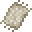
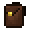

# Useful Items

###  Portable Crafter

**XP Cost:** 1 Level

**Research Group:** (none)

**Description:** A portable crafting table.



Crafted in an [Enhanced Crafting Table](basic-machines.md#enhanced-crafting-table).



Right-click with this item to open up a vanilla crafting table GUI.



###  Portable Dustbin

**XP Cost:** 2 Levels

**Research Group:** (none)

**Description:** A portable item-destroyer.



Crafted in an [Enhanced Crafting Table](basic-machines.md#enhanced-crafting-table).



Right-click to open a GUI and place any unwanted item(s) in it to dispose.



###  Rag

**XP Cost:** 2 Levels

**Research Group:** First Aid

**Description:** Level I - Medical Supply. Restores 2 hearts and extinguishes fire.



Crafted in an [Enhanced Crafting Table](basic-machines.md#enhanced-crafting-table).



Consumable.



###  Bandage

**XP Cost:** 2 Levels

**Research Group:** First Aid

**Description:** Level II - Medical Supply. Restores 4 hears and extinguishes fire.



Crafted in an [Enhanced Crafting Table](basic-machines.md#enhanced-crafting-table).



Consumable.



###  Splint

**XP Cost:** 2 Levels

**Research Group:** First Aid

**Description:** Level II - Medical Supply. Restores 2 hearts.



Crafted in an [Enhanced Crafting Table](basic-machines.md#enhanced-crafting-table).



Consumable.



###  Vitamins

**XP Cost:** 2 Levels

**Research Group:** First Aid

**Description:** Level III - Medical Supply. Restores 4 hearts, extinguishes fire, and cures poison, wither, and radiation.



Crafted in an [Enhanced Crafting Table](basic-machines.md#enhanced-crafting-table).



Consumable.



###  Medicine

**XP Cost:** 2 Levels

**Research Group:** First Aid

**Description:** Level III - Medical Supply. Restores 4 hearts, extinguishes fire, and cures poison, wither, and radiation.



Crafted in an [Enhanced Crafting Table](basic-machines.md#enhanced-crafting-table).



Consumable, similar to drinking a potion. Get an empty glass bottle back after consumption.



###  Small Backpack

**XP Cost:** 15 Levels

**Research Group:** Backpacks

**Description:** A portable storage container with 9 slots.



Crafted in an [Enhanced Crafting Table](basic-machines.md#enhanced-crafting-table).



**Directly Usage:**

* Right-click with it to open a storage GUI.

**Enhanced Crafting Table:**

* Small (dyed) Backpack of any color



###  Backpack

**XP Cost:** 15 Levels

**Research Group:** Backpacks

**Description:** A portable storage container with 18 slots.



Crafted in an [Enhanced Crafting Table](basic-machines.md#enhanced-crafting-table).



**Directly Usage:**

* Right-click with it to open a storage GUI.

**Enhanced Crafting Table:**

* (dyed) Backpack of any color



###  Large Backpack

**XP Cost:** 15 Levels

**Research Group:** Backpacks

**Description:** A portable storage container with 27 slots.



Crafted in an [Enhanced Crafting Table](basic-machines.md#enhanced-crafting-table).



**Directly Usage:**

* Right-click with it to open a storage GUI.

**Enhanced Crafting Table:**

* Large (dyed) Backpack of any color



###  Woven Backpack

**XP Cost:** 19 Levels

**Research Group:** (none)

**Description:** A portable storage container with 36 slots.



Crafted in an [Enhanced Crafting Table](basic-machines.md#enhanced-crafting-table).



**Directly Usage:**

* Right-click with it to open a storage GUI.

**Enhanced Crafting Table:**

* Woven (dyed) Backpack of any color



###  Gilded Backpack

**XP Cost:** 22 Levels

**Research Group:** (none)

**Description:** A portable storage container with 45 slots.



Crafted in an [Enhanced Crafting Table](basic-machines.md#enhanced-crafting-table).



**Directly Usage:**

* Right-click with it to open a storage GUI.

**Enhanced Crafting Table:**

* Gilded (dyed) Backpack of any color



###  Radiant Backpack

**XP Cost:** 25 Levels

**Research Group:** (none)

**Description:** A portable storage container with 54 slots.



Crafted in an [Enhanced Crafting Table](basic-machines.md#enhanced-crafting-table).



**Directly Usage:**

* Right-click with it to open a storage GUI.

**Enhanced Crafting Table:**

* Radiant (dyed) Backpack of any color



###  Cooler

**XP Cost:** 24 Levels

**Research Group:** Portable Beverages

**Description:** Allows you to store Juices/Smoothies and automatically consumes them when hungry if you have this in your inventory.



Crafted in an [Enhanced Crafting Table](basic-machines.md#enhanced-crafting-table).



**Direct Usage:**

* Right-click with it to open its GUI. Store Juice and Smoothies in it.

**Enhanced Crafting Table:**

* Food Synthesizer (LiteXpansion)



###  Tape Measure

**XP Cost:** 7 Levels

**Research Group:** (none)

**Description:** Measure distance between 2 points.



Crafted in an [Enhanced Crafting Table](basic-machines.md#enhanced-crafting-table).



**Direct Usage:**

* Shift right-click point A and right-click point B to take a measurement.


