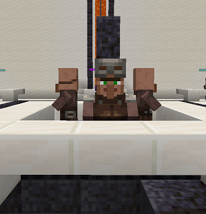

# Tier 3 - Pristine

## Upgrading from Tier 2 to Tier 3

All Tier 2 items can be upgraded to their Tier 3 Pristine form as long as they haven't been altered in any way. To upgrade, warp to Info Island and meet the 4 blacksmiths that reside in the center. The Armorer, Weaponsmith, and Toolsmith each have their own quests pertaining to the item being upgraded. You'll need your unaltered Polished item and a Pristine Token to upgrade. Pristine Tokens can be purchased from the server shop for $20,000,000.

Polished Recurve Crossbow --> Pristine Compound Crossbow has its own NPC: Crossbow Guy.


<mark style="color:red;">**USE CAUTION**</mark> when dealing with these NPCs. Do not click on a quest they're offering if you are not absolutely 100% ready to take it. These NPCs **WILL** take your corresponding Tier 3 item and/or Pristine Token that you're carrying. Canceling the quest will not return your item(s), they will be gone forever.&#x20;


### Armorer Upgrades:

* Polished Crown ---> Pristine Greathelm
* Polished Chestpiece ---> Pristine Battleplate
* Polished Wings ---> Pristine Wings
* Polished Platelegs ---> Pristine Legguards
* Polished Warboots ---> Pristine Sabatons
* Polished Warboots ---> Heavy Pristine Sabatons


The Armorer offers a secondary option for Sabatons: the Heavy Pristine Sabatons. The Heavy Pristine Sabatons **do not** have Lava Walking or Water Walking!


### Weaponsmith Upgrades:

* Polished Battleaxe ---> Pristine Broadaxe
* Polished Claymore ---> Pristine Gladius
* Polished Longbow ---> Pristine Compound Bow
* Polished Javelin ---> Pristine Pikestaff

### Toolsmith Upgrades:

* Polished Spade ---> Pristine Excavator
* Polished Spade ---> Precise Pristine Excavator
* Polished Pole ---> Pristine Pole
* Polished Earth-Grinder ---> Pristine Terraformer
* Polished Earth-Grinder ---> Precise Pristine Terraformer
* Polished Hoe ---> Pristine Hoe of Loyalty


The Toolsmith offers an extra option for you to get a Pristine Excavator without Trench or Smelting called the Precise Pristine Excavator.&#x20;

He also has an extra option for you to get a Pristine Terraformer without Trench or Smelting called the Precise Pristine Terraformer.


## Soul bound

Every Tier 3 item becomes Soul bound to the player who receives it during their upgrade process. This is automatic and there's no way to unbind it. This form of soul binding does not mean "to keep on death", it means it belongs solely to the player. No one else can pick it up off the ground or out of chests. If somehow someone else gets a hold of your soul bound item, it will be removed from their inventory and placed in an imaginary storage container and waits there for you to retrieve it. To retrieve your 'lost' soul bound item(s), run the command <mark style="color:blue;">**/returnitems**</mark> and it will open up this imaginary container where your item is waiting.

