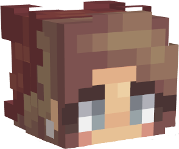
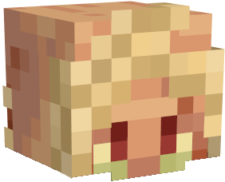

# Forgotten Mine

#### Type: Puzzle

#### Prerequisites: The Forsaken Chambers

#### Danger Level: 1 (possible fall damage and/or lava damage)

#### Difficulty: 4/5

#### What to bring: Nothing! (except for maybe some food); It is recommended to turn your brightness to Moody, and turn your volume on

#### Do Not:

* Put out the candles - they are there for lighting only
* Eat any items you find that may technically be edible
* Throw any items into lava
* Place any heads on the ground; this will render your item useless

### Goal: Reach the Shrine at the top of the mountain

### What to Do

#### Obtain the Charm of Sight by trading 12 Shards of Fear with the Dwarven Spirit

12 Shards of Fear

* 10 can be found&#x20;
* 2 must be obtained by trading other items with NPCs
  * Dried Fruit (trade with Hungry Little Piglin)
  * Spruce Bark (trade with Barking Mad)

#### Obtain the Lofty Feather by trading 6 Shards of Hope with the Chicken

6 Shards of Hope

* 4 can be found
* 2 must be crafted at the secret crafting table


The are Elite Crafting Table recipes. <mark style="color:red;">**DO NOT SHIFT-CLICK items into the crafting table**</mark>. Elite Crafting Tables are buggy and you have a high chance of losing your items FOREVER if you shift-click them.




 Shroom Villa

 Blazing Orb

 Baby Rat

 Peach Sheep

 Monty Mole

 Lonely Seagull

 Pengy the Penguin

 Decoy Skull

 Odd Skull

 The Crow

 Gold Cube

 Dwarven Notch

 Ultra Block

 Fresh Pineapple

 Yeti Remains

 Ice Rune




 Poggerz

 Rainbow Stack

 Axe A Little

 Santa's Doggy

 Human Skull

 Lava Lamp

 Bilbo Baggins

 Sus

 Link

 Lost Traveler's Cat

 Winter Bee

 Fire Wood

 Unconventional Farmer

 Lost Traveler

 Hidden Gem

 Laiken the Mermaid




At some point, you will obtain another key item needed to find these artifacts.


Everything you need to complete the dungeon is provided within the dungeon!&#x20;


After you've completed all of the above, find your way to the Shrine at the top of the mountain.

### What now?

You'll receive a special item after dungeon completion for you to keep as a memento! Congratulations!


If you somehow collected extra dungeon items during your journey, keep them to yourself or trash them. They are not to be given, traded, or sold to others.

