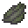

# The Forsaken Chambers

#### Type: Puzzle

#### Danger Level: 1 (unlikely mob spawning in darker areas)

#### Difficulty: 3/5

#### What to bring: Nothing! (except for maybe some food)

#### Do not:&#x20;

* Put out the candles - they are there for lighting only
* Eat any items you find that may technically be edible
* Put any flowers in the flower pots; this will render your item useless
* Craft any items into dye; this will render your item useless

### Goal: Craft the Enlightened Orb at the Altar of the Damned

### What to Do

#### Search the dungeon to obtain the 16 Sacred Stones:

* Qi (requires mini-quest: Reeker)
* Karma (requires mini-quest: Horace)
* Anima Mundi
* Gaian Mind
* Odic Force (requires mini-quest: Odin)
* Ashtar Sheran
* Kala
* Mana (requires mini-quest: Alegra the Witch)
* Gnosis
* Ike
* Makia
* Manawa
* Pono (requires mini-quest: Lazarus)
* Helios
* Aether
* Galene

As you can see, some Sacred Stones require you to do mini-quests for you to be able to obtain them. You will find other items while making your way through the dungeon. Read the lore on these items, they give hints to what you're supposed to do, and speak to NPCs.

Items you'll come across that are involved in mini-quests:

* Horace's Bone
  * Horace is looking for his missing leg bone. He will be very pleased if you return it to him!
* Soul Fragment (x2)
  * Alegra the Witch wants you to make some Ectoplasm for her. To do this, put two Soul Fragments in a cauldron and then give them to her for a reward!
* Reeker's Flesh
  * Reeker likes to eat his own flesh. The problem is that he needs it to be cooked to a crisp because he has a sensitive tummy. If you burn his flesh on a fire and then give it to him, he'll reward you greatly!
* Rose for Rose
  * Lazarus picked this rose for his wife Rose, except she doesn't like things that are alive. Cooking it should kill it! Return the Dead Rose for Rose to Lazarus so he can give it to her.
* Raw Diamond and Gold Bar
  * Odin needs a gold and diamond ring for his ritual but he can't leave the circle. Find the smithing table to craft his ring and return it to him.

Take note at the beginning of the dungeon, the recipe for the Enlightened Orb is shown to you on the wall.&#x20;

.png>)

#### Locate the Altar of the Damned

The Altar of the Damned is in a hidden secret room. This altar is an Elite Crafting Table and there are warnings all over the place to <mark style="color:red;">**NOT SHIFT-CLICK ITEMS INTO THE CRAFTING TABLE**</mark>. Please carefully head this warning! Elite Crafting Tables are buggy and there's a high chance you will lose your items FOREVER.

When you've located the Altar of the Damned, place each Sacred Stone in its correct slot to craft the Enlightened Orb.

After you put the Enlightened Orb in your inventory, the Forsaken Chambers dungeon quest will automatically complete and you will be teleported back to spawn.

### What Now?

After you've completed the dungeon, you now have access to 3 warps:

* <mark style="color:blue;">**/warp StellarSeller**</mark>
* <mark style="color:blue;">**/warp VillagerSpawner**</mark>
* <mark style="color:blue;">**/warp ForgottenMine**</mark>

#### Stellar Seller

Since villager trades are globally turned off, the _only_ way to get **What A Deal** and **Star Trader** advancements is to take the Enlightened Orb to this warp and make a trade with the NPC there. He'll give you a Telescope item in return, which is for you to keep as a memento

#### Villager Spawner

This warp has a 5x Villager Spawner where you can farm. Use their heads for selling or use them to trade for items at the shop located there. You'll find many NPCs that offer a variety of items.

#### Forgotten Mine

If you enjoyed The Forsaken Chambers, the next dungeon is [Forgotten Mine](forgotten-mine.md) which is also a puzzle type.


If you somehow collected extra dungeon items during your journey, keep them to yourself or trash them. They are not to be given, traded, or sold to others.

