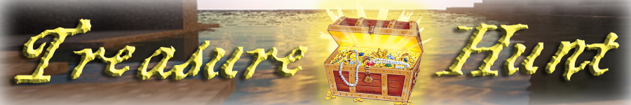

# Events

The frequency of events typically depends on the amount of players, especially newer players, at a given time.&#x20;

Occasionally we will have surprise events but mostly they are scheduled and announced via discord and in game.

XP parties and Money parties are help at the Event Hub. You can get there by warping or walking south at spawn.

## XP Party

It is encouraged to bring your Slimefun guides and rank up during XP parties!

XP dropped here _does_ count towards rank quest Experience Earning. It's possible to finish the current Experience Earning quest you're doing, go to spawn to rank up real quick, start your next Experience Earning quest and get a huge head start or even complete that one too!

Typically you can expect to receive between 300 and 600 _levels_, depending on how many people are there.

You might want to consider turning off your particle settings, it does get pretty crazy in there!

Sometimes we run XP and Money parties back-to-back!



## Money Party

In general, people usually make $1mil to $3mil during a Money party.&#x20;

The way it works is we spawn money in the form of emerald 'items' of value all over the place in the Event Hub and you just run around and pick it up! These don't enter your inventory in actual item form, the amount you pick up automatically gets added to your balance.

Keep in mind, this causes at least some lag for most people.


<mark style="color:red;">**MAGNETS ARE NOT ALLOWED**</mark> at the Money parties! All magnets caught being used will be confiscated and later returned after the event is over.




## Treasure Hunt

Treasure Hunts work differently than the previously mentioned events since they are not held at the Event Hub, they are held at an arena. A mass TPA request is sent out to all players 5-10 minutes before the event starts. We currently have 2 arenas: Coral Course and Mine-Hold.

The Treasure Item we will be searching for will be announced and displayed. During your search for that Treasure Item, you will most likely find other secondary items that you can keep such as Lucky Blocks.&#x20;

Accepting the TPA request will bring you to an empty box that we wait in. When the event is about to start, a countdown timer will show up on your screen and when it reaches 0, the walls come down. Time to start searching!

Search the chests and barrels for the previously announced Treasure Item. Lots of chests will be empty or contain other random secondary 'prizes'. You do not have to link these secondary prizes in chat.&#x20;

If you find the Treasure Item, you must link that item in chat to let everyone know you've found it!

Link items in chat by holding the item in your main hand and typing <mark style="color:blue;">**\[item]**</mark>.
